# The Kit Box

**The Kit Box** is a full-stack Django e-commerce web application designed for selling automotive modeling kits.
Users can browse products, filter by category, view detailed product pages, manage a shopping cart, and complete secure purchases through Stripe.

Users can create accounts to save products to a wishlist and manage their orders, while administrators have access to a custom dashboard to create, edit, disable, or remove products and view orders directly from the site interface.

Live Site: https://the-kit-box-ad068539bb2b.herokuapp.com/

Repository: https://github.com/JackLamb99/the-kit-box

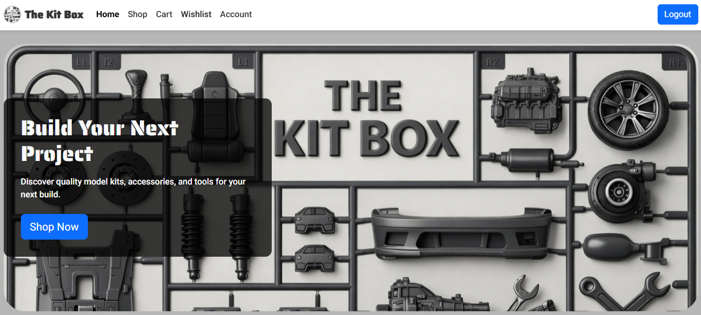

## Table of Contents

- [User Stories](#user-stories)
- [Design](#design)
  - [Wireframes](#wireframes)
  - [Typography](#typography)
- [Database Schema](#database-schema)
  - [Entity Relationship Diagram](#entity-relationship-diagram-erd)
  - [Category](#category)
  - [Product](#product)
  - [ProductImage](#productimage)
  - [Order](#order)
  - [OrderItem](#orderitem)
  - [WishlistItem](#wishlistitem)
- [Testing](#testing)
  - [Compatibility and Responsiveness](#compatibility-and-responsiveness)
  - [Functional Testing](#functional-testing)
  - [Validation](#validation)
  - [Lighthouse](#lighthouse)
  - [Bugs](#bugs)
  - [Unfixed Bugs](#unfixed-bugs)
- [Technologies Used](#technologies-used)
  - [Languages](#languages)
  - [Frameworks and Libraries](#frameworks-and-libraries)
  - [Database](#database)
  - [Payments and Media](#payments-and-media)
  - [Deployment and Development Tools](#deployment-and-development-tools)
  - [Design and Assets](#design-and-assets)
- [Deployment](#deployment)
  - [Version Control](#version-control)
  - [Deploying to Heroku](#deploying-to-heroku)
  - [Connecting to GitHub](#connecting-to-github)
  - [Enable Automatic Deploys](#enable-automatic-deploys)
  - [Environment Variables](#environment-variables)
  - [Buildpacks](#buildpacks)
  - [Final Deployment](#final-deployment)
  - [Running the Project Locally](#running-the-project-locally)
- [Credits](#credits)
  - [Code](#code)
  - [Media](#media)

## User Stories

1. As a new visitor, I want to quickly understand what the website offers, so that I know what products are available.

- The homepage features a large hero section explaining the purpose of the site and includes clear call-to-action buttons directing users to browse the shop or create an account.

  <details><summary>Homepage Hero Section</summary>

  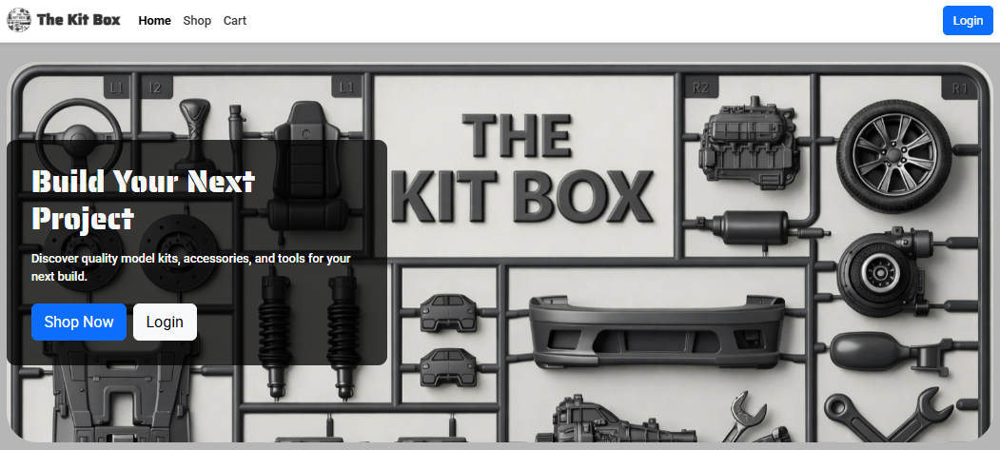

  </details>

2. As a user, I want to easily browse available products.

- The shop page displays products in a clear card layout with images, pricing, stock status, and quick access to add items to the cart.

  <details><summary>Shop Page</summary>

  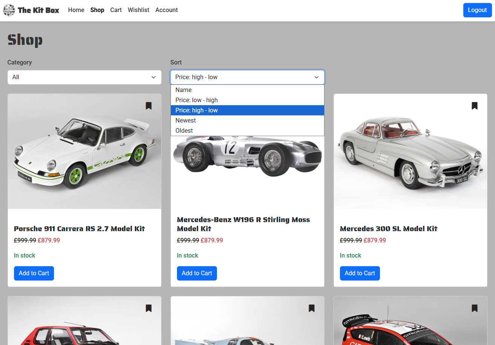

  </details>

3. As a user, I want to filter and sort products so I can find items more easily.

- The shop page allows users to filter products by category and sort them by price, name, or date added.

  <details><summary>Shop Filtering and Sorting</summary>

  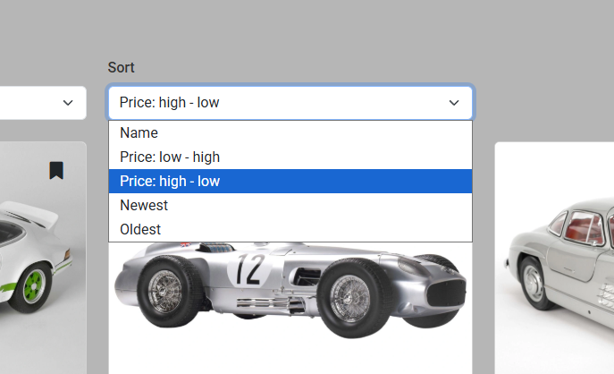

  </details>

4. As a customer, I want to add products to my cart so that I can purchase them later.

- Products can be added directly from the shop page using the **Add to Cart** button.

  <details><summary>Add to Cart</summary>

  

  </details>

5. As a customer, I want to review and update my cart before purchasing.

- The cart page allows users to update product quantities, remove items, and view the current cart total.

  <details><summary>Cart Page</summary>

  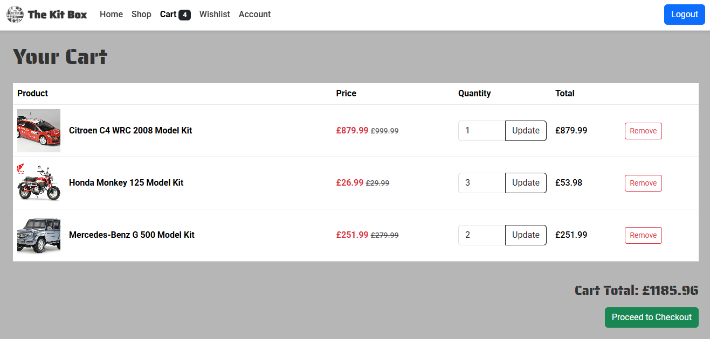

  </details>

6. As a customer, I want to securely complete my purchase online.

- The checkout page allows users to enter delivery details and securely complete payment using Stripe.

  <details><summary>Checkout Page</summary>

  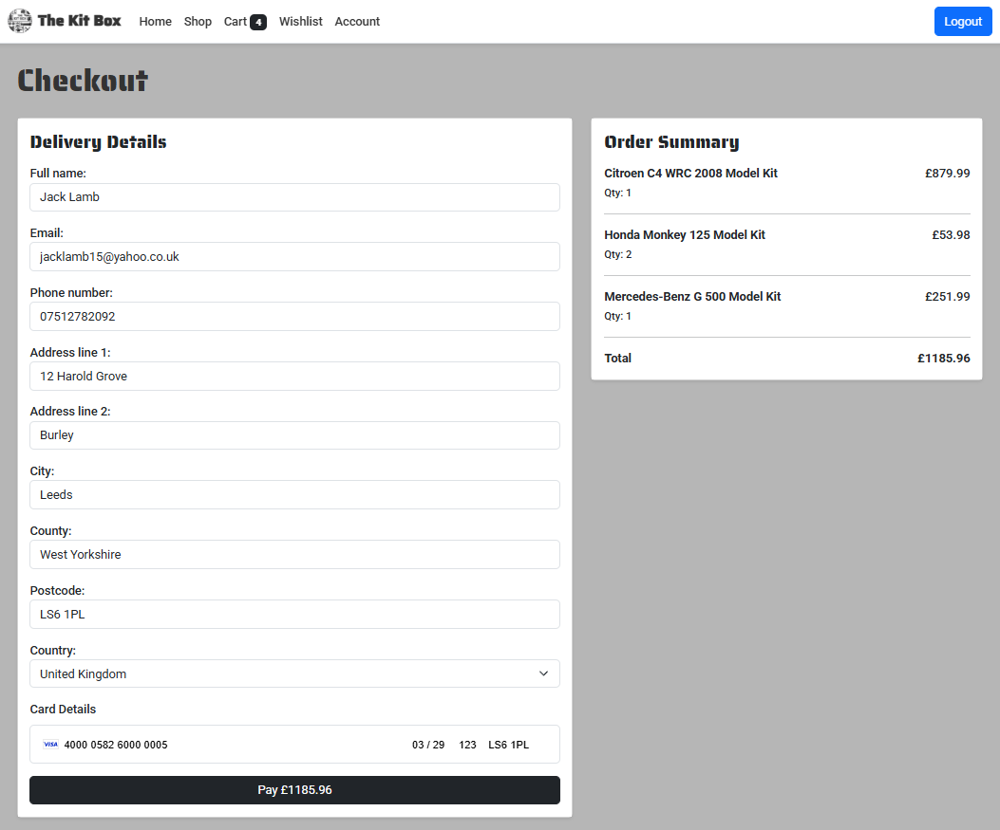

  </details>

7. As a customer, I want confirmation that my order was successful.

- After completing a purchase, users are taken to an order confirmation page showing their order number and purchase details.

  <details><summary>Order Confirmation</summary>

  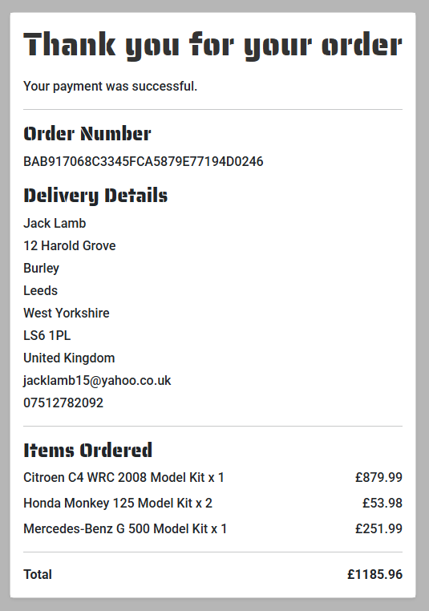

  </details>

8. As a user, I want to create an account so that I can track my orders.

- The site includes a registration system allowing users to create accounts and access personalised features.

  <details><summary>Registration Page</summary>

  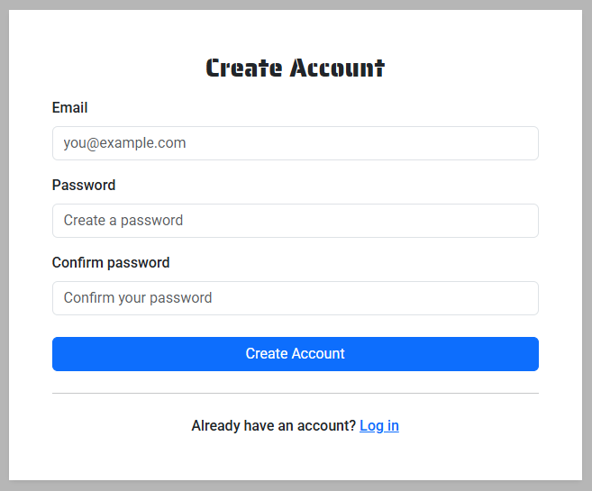

  </details>

9. As a returning user, I want to log in to my account to manage my information.

- Users can log in using their registered email and password to access their account dashboard.

  <details><summary>Login Page</summary>

  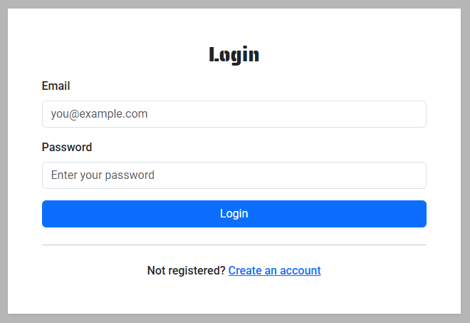

  </details>

10. As a logged-in user, I want to manage my personal information.

- The **My Account** page allows users to update personal details such as address and contact information.

  <details><summary>Account Details</summary>

  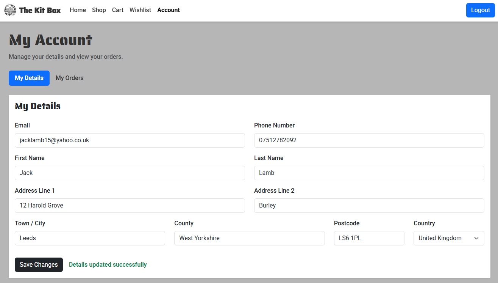

  </details>

11. As a registered customer, I want to view my past orders.

- Registered users can view their order history within their account page, including order dates and totals.

  <details><summary>My Orders</summary>

  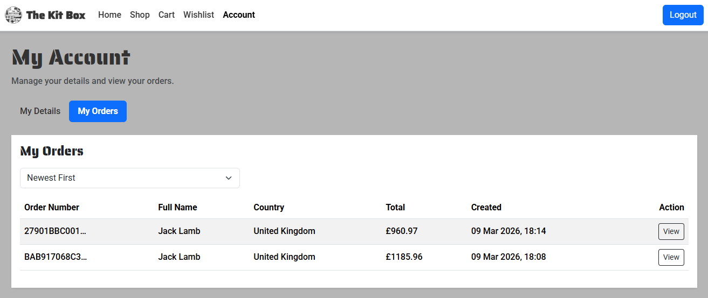

  </details>

12. As a user, I want to save products to a wishlist for later.

- Logged-in users can add products to a wishlist and revisit them later.

  <details><summary>Wishlist</summary>

  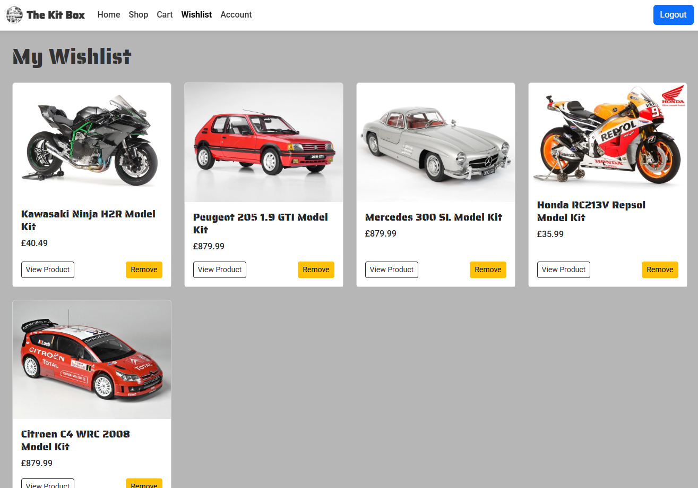

  </details>

13. As an admin, I want to manage products directly from the website.

- The admin dashboard allows administrators to create, edit, disable, and delete products.

  <details><summary>Admin Products</summary>

  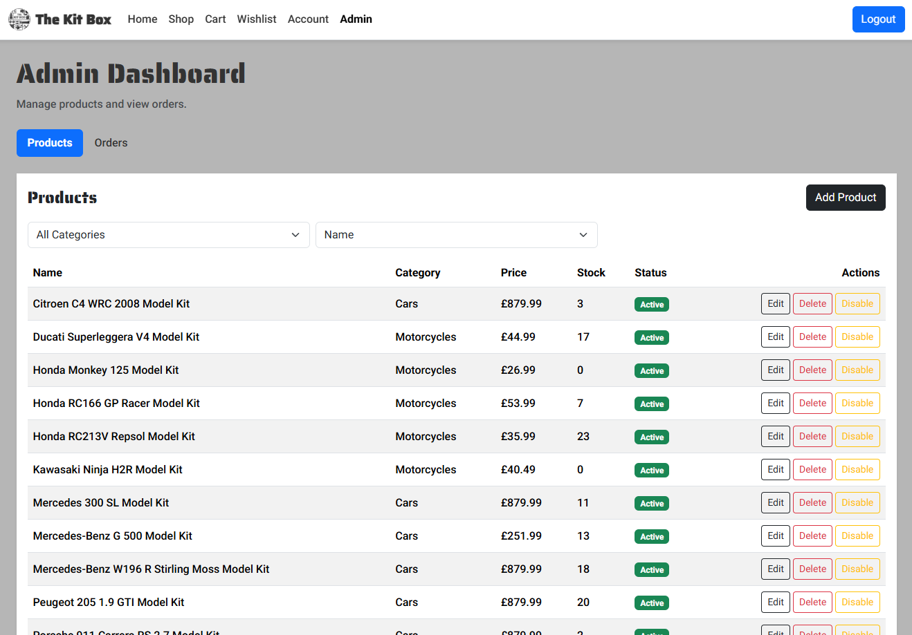

  </details>

14. As an admin, I want to view and manage customer orders.

- The admin dashboard includes an orders section where admins can review customer purchases and order details, including sorting by date.

  <details><summary>Admin Orders</summary>

  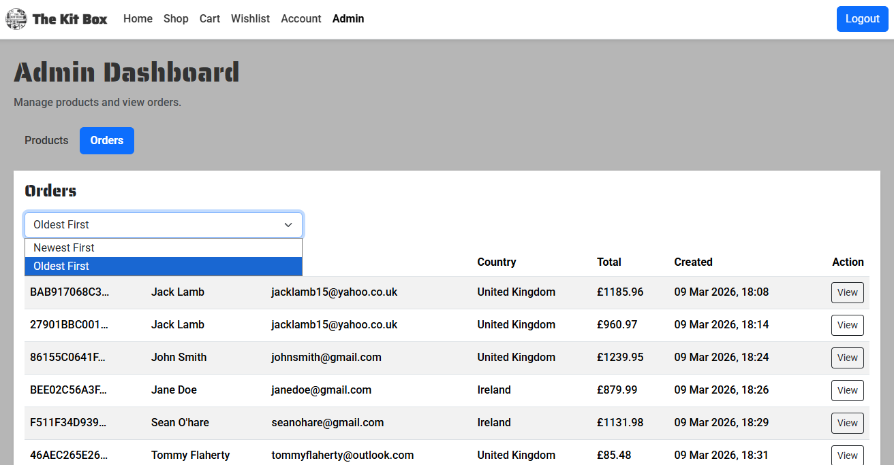

  </details>

## Design

The design of **The Kit Box** focuses on simplicity, clarity, and ease of navigation.
The goal was to create a clean e-commerce interface where users can quickly browse products, manage their cart, and complete purchases with minimal friction.

The layout was built using **Bootstrap** to ensure responsiveness across a wide range of devices.

### Wireframes

Initial wireframes were created during the planning phase of the project to outline the layout and structure of key pages.
These wireframes were hand-drawn to quickly visualise the layout of the interface, including navigation, product listings, cart functionality, and account admin. They were then used as a reference during development when building the front-end structure.

<details><summary>Home and Shop Wireframes</summary>

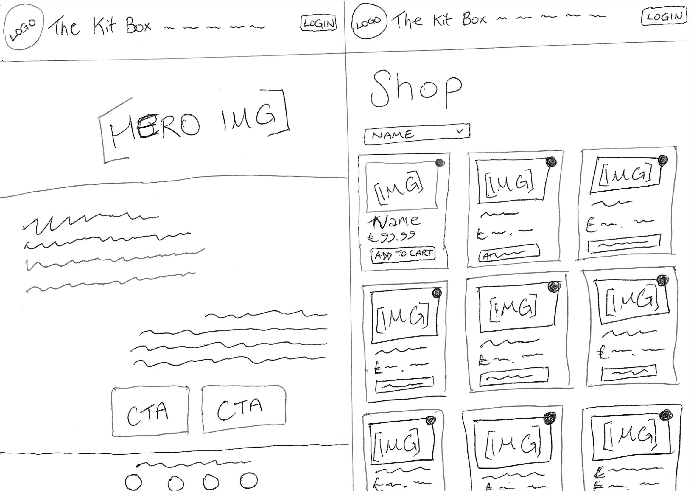

</details>

<details><summary>Cart and Wishlist Wireframes</summary>

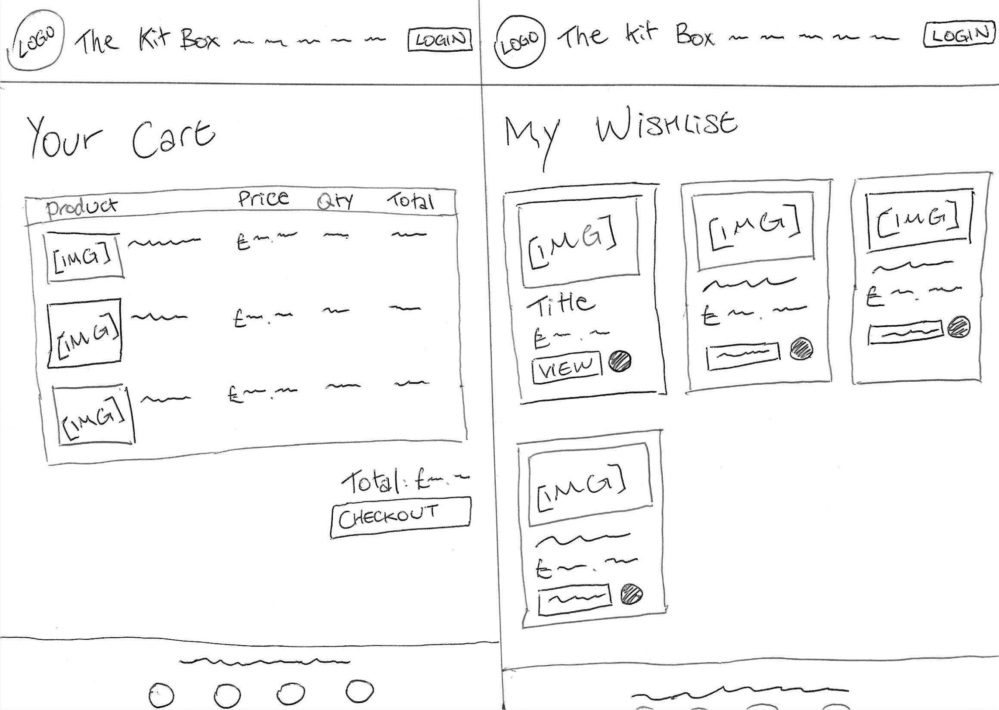

</details>

<details><summary>Account and Admin Wireframes</summary>

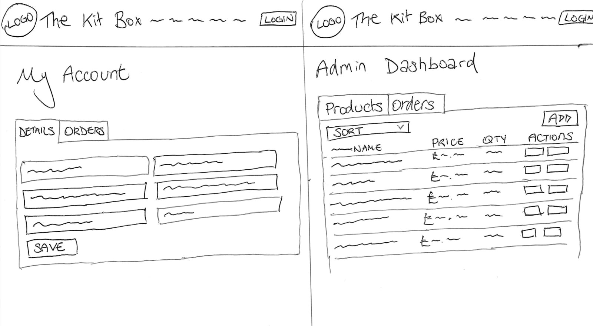

</details>

### Typography

Two fonts were used to create a clear visual hierarchy across the site.

**Saira Stencil One**
- Used for page headers and key titles
- Gives the site a bold, industrial aesthetic that suits the theme of model kits and mechanical parts.

**Roboto**
- Used for body text and general UI elements
- Provides high readability across all devices.

## Database Schema

The application uses a relational database structure designed through Django models.
The database was planned to support product browsing, cart and checkout functionality, customer orders, wishlisting, and admin product management.

### Entity Relationship Diagram (ERD)

The Entity Relationship Diagram below shows the structure of the database and the relationships between the main models used throughout the application.

<details><summary>Database ERD</summary>

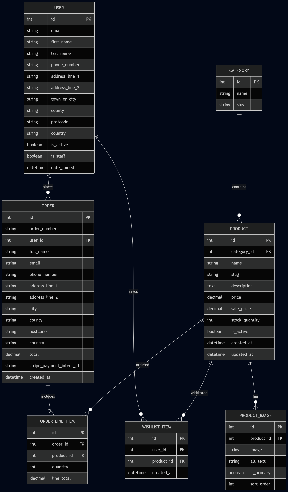

</details>

The database structure follows Django's relational model structure and helps maintain data integrity between products, categories, orders, images, and user-linked data.

### Category

The `Category` model is used to organise products into groups, making browsing and filtering easier for users.

**Key fields:**
- `name` - the display name of the category
- `slug` - a unique URL-friendly version of the category name

**Relationships:**
- One category can have many products
- A product belongs to one category

### Product

The `Product` model stores the main information for each item available in the shop.

**Key fields:**
- `category` - foreign key linking the product to a category
- `name` - the product name
- `slug` - unique URL-friendly identifier
- `description` - full product description
- `price` - standard product price
- `sale_price` - optional discounted price
- `stock_quantity` - current available stock
- `created_at` - date the product was created
- `updated_at` - date the product was last updated

**Relationships:**
- Each product belongs to one category
- Each product can have multiple associated images
- Each product can appear in multiple order items
- Each product can be linked to wishlist entries

### ProductImage

The `ProductImage` model allows each product to have one or more associated images.

**Key fields:**
- `product` - foreign key linking the image to a product
- `image` - the uploaded image file
- `alt_text` - descriptive alternative text for accessibility
- `sort_order` - controls the display order of product images
- `is_primary` - determines which image should be shown as the main image

**Relationships:**
- One product can have many images
- Each image belongs to one product

This structure provides flexibility for displaying a primary product image as well as additional gallery images.

### Order

The `Order` model stores customer order information created during checkout.

**Key fields:**
- `user` - optional foreign key linking the order to a registered user
- `full_name` - customer name
- `email` - customer email
- `phone_number` - customer phone number
- `address_line_1` - delivery address line 1
- `address_line_2` - delivery address line 2
- `town_or_city` - town or city
- `county` - county
- `postcode` - postcode
- `country` - country
- `stripe_pid` - Stripe payment intent ID
- `original_cart` - stored cart snapshot
- `order_total` - total cost of the order
- `created_at` - date and time the order was placed

**Relationships:**
- One order can contain many order items
- An order may optionally belong to a registered user

This model stores both the customer's delivery details and the payment/order summary needed for fulfilment.

### OrderItem

The `OrderItem` model stores the individual products included in an order.

**Key fields:**
- `order` - foreign key linking the item to an order
- `product` - foreign key linking the item to a product
- `quantity` - number of units ordered
- `lineitem_total` - total cost for that item based on quantity and price

**Relationships:**
- Each order item belongs to one order
- Each order item refers to one product

This model creates the many-to-one relationship needed for a single order to contain multiple products.

### WishlistItem

The `WishlistItem` model allows logged-in users to save products for later.

**Key fields:**
- `user` - foreign key linking the wishlist item to a user
- `product` - foreign key linking the wishlist item to a product
- `created_at` - date the item was added

**Relationships:**
- One user can have many wishlist items
- A product can appear in many users' wishlists

This model supports the wishlist feature by linking users to products they want to revisit later.

## Testing

### Compatibility and Responsiveness

Tested on Chrome, Edge, Firefox, and Safari using Chrome DevTools across:
- 1920 × 1080 desktop
- iPad Air
- Samsung Galaxy S20
- iPhone 15

**Result:**
All primary user-facing layouts adjusted correctly with no horizontal scroll or broken components. The navbar, cards, modals, and accordions functioned across all breakpoints.

<details><summary>Laptop Responsiveness</summary>

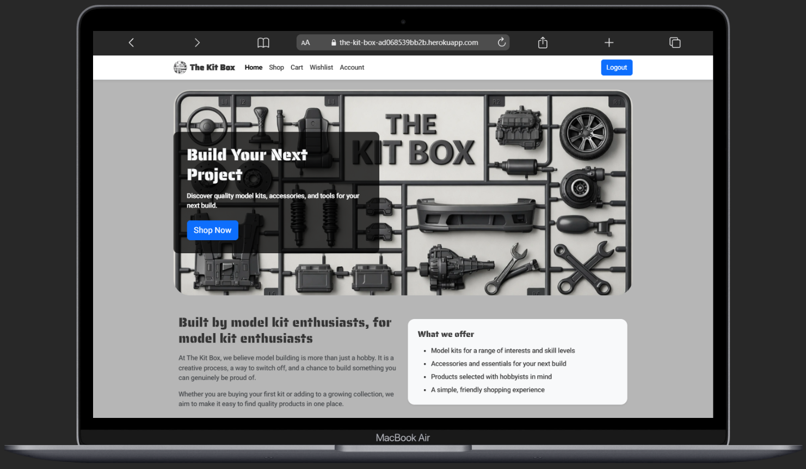

</details>

<details><summary>Tablet Responsiveness</summary>

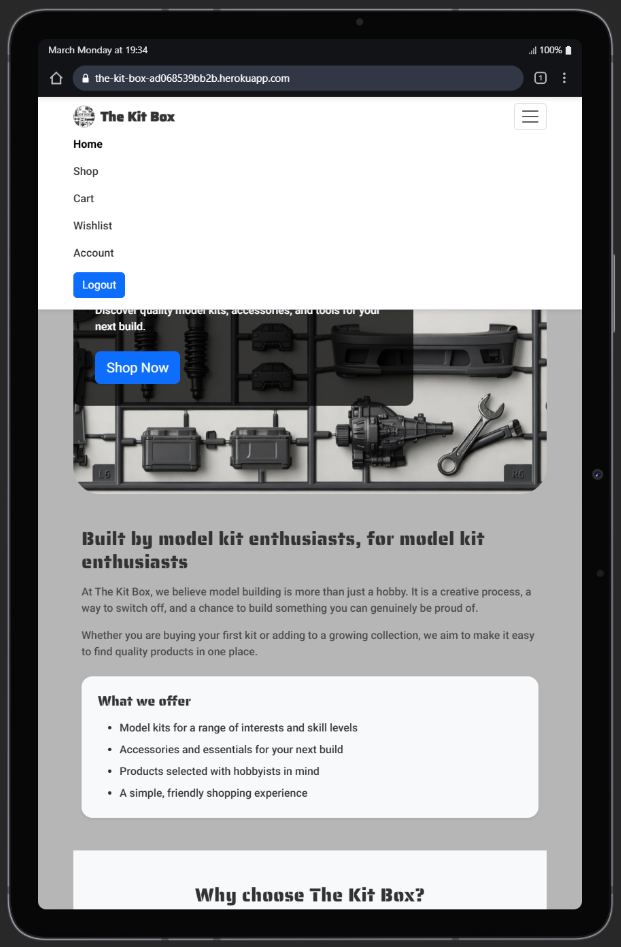

</details>

<details><summary>Mobile Responsiveness</summary>

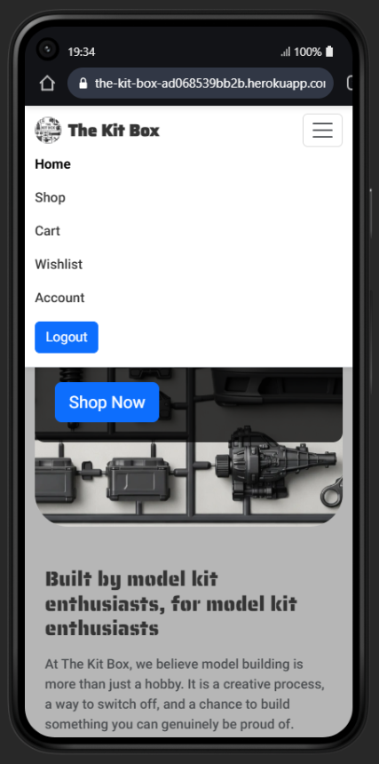

</details>

### Functional Testing

Manual testing was performed across all interactive and dynamic elements of **The Kit Box**.

#### 1. Homepage Navigation and Calls to Action

**Process:**
Load the homepage and use the main call-to-action buttons and navigation links.

**Expected:**
The homepage loads correctly, clearly communicates the purpose of the site, and the navigation/buttons direct users to the correct pages.

**Result:**
Works as expected.

#### 2. User Registration

**Process:**
Fill in all required registration fields and submit the form.

**Expected:**
A new user account is created successfully and the user is able to access authenticated site features.

**Result:**
Works as expected.

#### 3. User Login and Logout

**Process:**
Log in using valid credentials, then log out using the navbar option.

**Expected:**
Logging in updates the navigation to show authenticated account options. Logging out removes access to logged-in features and returns the user to the public site state.

**Result:**
Works as expected.

#### 4. Anonymous User Access Restriction

**Process:**
Attempt to access account-only pages such as wishlist, account details, and order history without being logged in.

**Expected:**
Unauthenticated users are redirected appropriately and cannot access restricted pages.

**Result:**
Works as expected.

#### 5. Product Browsing

**Process:**
Navigate to the shop page and scroll through available products.

**Expected:**
Products display correctly with image, name, price, and relevant action buttons.

**Result:**
Works as expected.

#### 6. Product Filtering and Sorting

**Process:**
Use the available category filters and sorting controls on the shop page.

**Expected:**
Products update according to the selected category and sort order.

**Result:**
Works as expected.

#### 7. Product Detail Page

**Process:**
Select a product from the shop page to open its individual detail page.

**Expected:**
The selected product page loads correctly and displays full product information, pricing, stock quantity, and purchase controls.

**Result:**
Works as expected.

#### 8. Add to Cart from Shop Page

**Process:**
Click the **Add to Cart** button from a product card on the shop page.

**Expected:**
One unit of the selected product is added to the cart and the cart total/count updates accordingly.

**Result:**
Works as expected.

#### 9. Add to Cart from Product Detail Page

**Process:**
Open a product detail page, set a valid quantity, and click **Add to Cart**.

**Expected:**
The selected quantity is added to the cart and reflected in the cart page and navbar cart count.

**Result:**
Works as expected.

#### 10. Cart Quantity Update

**Process:**
Open the cart page and increase or decrease the quantity of an existing cart item.

**Expected:**
The cart updates correctly and recalculates totals immediately.

**Result:**
Works as expected.

#### 11. Cart Item Removal

**Process:**
Remove a product from the cart using the remove option.

**Expected:**
The selected item is removed from the cart and the total updates correctly.

**Result:**
Works as expected.

#### 12. Stock Validation in Cart

**Process:**
Attempt to set a cart quantity greater than the available stock.

**Expected:**
The site prevents the quantity from exceeding available stock and provides appropriate validation behaviour.

**Result:**
Works as expected.

#### 13. Empty Cart Behaviour

**Process:**
Remove all items from the cart or visit the cart without adding any products.

**Expected:**
The cart page displays a suitable empty-cart message and provides navigation back to the shop.

**Result:**
Works as expected.

#### 14. Wishlist Add Functionality

**Process:**
While logged in, add a product to the wishlist by toggling the bookmark icon.

**Expected:**
The item is saved to the logged-in user's wishlist and appears on the wishlist page.

**Result:**
Works as expected.

#### 15. Wishlist Removal Functionality

**Process:**
Remove a saved product from the wishlist.

**Expected:**
The item is removed from the wishlist immediately and no longer appears in the saved list.

**Result:**
Works as expected.

#### 16. Checkout Form Submission

**Process:**
Add products to the cart, proceed to checkout, complete all required delivery details, and submit payment using Stripe test details.

**Expected:**
The payment is processed successfully, the order is created in the database, and the user is redirected to the order confirmation page.

**Result:**
Works as expected.

#### 17. Checkout Form Validation

**Process:**
Attempt to submit the checkout form with required fields left blank or invalid information entered.

**Expected:**
The form does not submit and validation errors are shown to the user.

**Result:**
Works as expected.

#### 18. Order Confirmation Page

**Process:**
Complete a successful order and review the resulting confirmation page.

**Expected:**
The confirmation page displays the correct order summary, customer details, and purchased items.

**Result:**
Works as expected.

#### 19. My Details Page

**Process:**
Log in and update details through the account details page.

**Expected:**
Updated information is saved successfully and displayed correctly on subsequent visits.

**Result:**
Works as expected.

#### 20. My Orders Page

**Process:**
Log in as a user who has placed one or more orders and open the **My Orders** page.

**Expected:**
Previous orders are listed correctly with relevant order information.

**Result:**
Works as expected.

#### 21. Admin Dashboard Access Restriction

**Process:**
Attempt to access the dashboard while logged out or logged in as a non-admin user.

**Expected:**
Only authorised admin users can access the dashboard; non-admin users are denied access and redirected.

**Result:**
Works as expected.

#### 22. Admin Product Creation

**Process:**
Log in as an admin, open the dashboard product form, and create a new product with valid details.

**Expected:**
The product is created successfully and appears in the shop and dashboard product list.

**Result:**
Works as expected.

#### 23. Admin Product Editing

**Process:**
Edit an existing product through the dashboard.

**Expected:**
Changes are saved successfully and reflected immediately on the frontend.

**Result:**
Works as expected.

#### 24. Admin Product Deletion

**Process:**
Delete an existing product through the dashboard.

**Expected:**
The product is removed successfully and no longer appears in the shop.

**Result:**
Works as expected.

#### 25. Admin Product Disable / Availability Control

**Process:**
Toggle a product's active/disabled status through the dashboard.

**Expected:**
Disabled products are removed from customer-facing purchase views while remaining manageable through the dashboard.

**Result:**
Works as expected.

#### 26. Admin Category Creation

**Process:**
Create a new category while creating or editing a product through the dashboard.

**Expected:**
The new category is saved successfully and becomes available in product organisation and shop filtering.

**Result:**
Works as expected.

#### 27. Admin Image Upload

**Process:**
Log in as an admin, create a new product, then upload product imagery from the edit product page.

**Expected:**
After a product is created, the admin is redirected to the edit page where images can be uploaded successfully and displayed on the product page.

**Result:**
Works as expected.

#### 28. Admin Order Viewing

**Process:**
Log in as an admin and review customer orders in the dashboard orders section.

**Expected:**
Order details are displayed correctly, including customer information and purchased items.

**Result:**
Works as expected.

#### 29. Custom 404 Page

**Process:**
Enter an invalid URL into the browser.

**Expected:**
A custom 404 page is displayed with helpful navigation back to valid site pages.

**Result:**
Works as expected.

#### 30. Responsive Navigation

**Process:**
Resize the site to tablet and mobile screen widths and test the navbar toggle.

**Expected:**
The navigation collapses correctly on smaller screens and remains fully usable.

**Result:**
Works as expected.

#### 31. Responsive Layout

**Process:**
View the homepage, shop, cart, checkout, and account pages on desktop, tablet, and mobile screen sizes.

**Expected:**
The layout remains readable, usable, and visually consistent across different device sizes without horizontal overflow.

**Result:**
Works as expected.

### Validation

#### HTML

The HTML pages were validated using the [W3C Markup Validator](https://validator.w3.org/).
No critical errors were found.

<details><summary>Validation - HTML</summary>

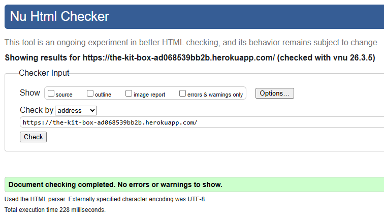

</details>

#### CSS

The CSS stylesheet was validated using the [W3C CSS Validator](https://jigsaw.w3.org/css-validator/).
No errors were detected.

<details><summary>Validation - CSS</summary>

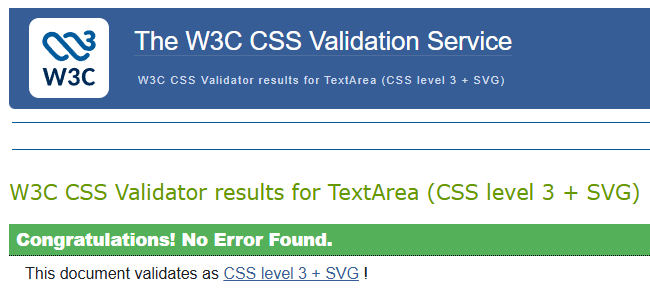

</details>

#### JavaScript

The JavaScript used throughout the project was validated using [JSHint](https://jshint.com/).
No major issues were reported.

#### Python

The Python files were checked using `flake8` linting to ensure clean and readable code.
No critical issues were identified.

### Lighthouse

Lighthouse audits were performed on the main pages of the application using Chrome DevTools.

The site achieved strong scores across all four Lighthouse categories:

- Performance
- Accessibility
- Best Practices
- SEO

These results confirm that the site follows modern web performance and accessibility standards.

<details><summary>Lighthouse</summary>

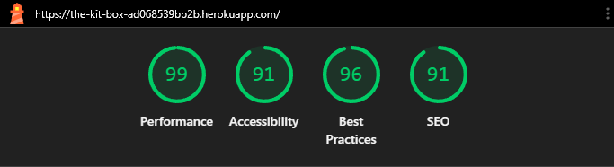

</details>

### Bugs

| Issue | Cause | Resolution |
|------|------|------------|
| Cart table overflow on small screens | Too many columns for narrow viewport | Adjusted layout with responsive Bootstrap classes |
| Hero text readability over image | Background image reduced contrast | Added semi-transparent overlay behind text |
| Product image upload unavailable on product creation | Image upload section only rendered when editing existing product | Redirected admin to edit page immediately after product creation so images can be uploaded |
| Cart quantity exceeding stock | Quantity inputs allowed manual over-entry | Added stock validation logic to prevent quantities exceeding available stock |

### Unfixed Bugs

- The admin dashboard requires some horizontal scrolling on smaller mobile devices due to the amount of information and number of fields displayed in the products and orders sections. Functionality is unaffected, but the layout is not fully optimised for very narrow screens.

All other known issues were resolved prior to the final deployment.

## Technologies Used

### Languages

- [Python](https://docs.python.org/) - Used as the primary backend programming language for building the application's server-side logic.

- [HTML5](https://developer.mozilla.org/en-US/docs/Web/HTML) - Used to structure the frontend pages and content across the site.

- [CSS3](https://developer.mozilla.org/en-US/docs/Web/CSS) - Used to style the website and customise the appearance of Bootstrap components.

- [JavaScript](https://developer.mozilla.org/en-US/docs/Web/JavaScript) - Used to add dynamic behaviour to the site, including slug generation and interactive UI elements.

### Frameworks and Libraries

- [Django 5](https://www.djangoproject.com/) - The main web framework used to build the full-stack application, manage database models, views, templates, and authentication.

- [Bootstrap 5](https://getbootstrap.com/) - Used to build the responsive layout, grid system, navigation components, and form styling.

- [Django Allauth](https://django-allauth.readthedocs.io/) - Used to provide user authentication features including registration, login, and logout.

- [Font Awesome](https://fontawesome.com/) - Used to provide icons throughout the user interface.

### Database

- [PostgreSQL](https://www.postgresql.org/) - Used as the production database to store application data including products, categories, orders, and user information.

- [Psycopg2](https://www.psycopg.org/) - PostgreSQL database adapter used by Django to communicate with the PostgreSQL database.

### Payments and Media

- [Stripe](https://stripe.com/) - Integrated to provide secure online payment processing during checkout.

- [Cloudinary](https://cloudinary.com/) - Used to store and serve uploaded product images in the cloud.

### Deployment and Development Tools

- [Gunicorn](https://gunicorn.org/) - Used as the production WSGI server to run the Django application on Heroku.

- [Heroku](https://www.heroku.com/) - Used to deploy and host the live version of the application.

- [Git](https://git-scm.com/docs) - Used for version control throughout the development process.

- [GitHub](https://github.com/) - Used to store the project repository and manage version history.

- [Visual Studio Code](https://code.visualstudio.com/) - Used as the primary development environment for writing and managing project code.

### Design and Assets

- [Google Fonts](https://fonts.google.com/) - Used to import the **Saira Stencil One** and **Roboto** fonts used throughout the site.

- [Favicon.io](https://favicon.io/) - Used to generate the site's favicon.

## Deployment

### Version Control

The project was developed using **Git** for version control and **GitHub** for repository hosting.

Changes were committed using the following workflow:

```bash
git add .
git commit -m "Commit message"
git push
```

Repository: [the-kit-box](https://github.com/JackLamb99/the-kit-box)

### Deploying to Heroku

The application is deployed using **Heroku**.

1. Log in to the Heroku dashboard.
2. Click **New > Create new app**.
3. Enter an app name.
4. Select a region (Europe recommended).
5. Click **Create app**.

### Connecting to GitHub

1. Open the **Deploy** tab.
2. Select **GitHub** as the deployment method.
3. Connect your GitHub account.
4. Search for the repository name.
5. Click **Connect**.

### Enable Automatic Deploys

1. In the **Deploy** tab, locate **Automatic Deploys**.
2. Select the `main` branch.
3. Click **Enable Automatic Deploys**.

### Environment Variables

In the **Settings > Config Vars** section, the following environment variables must be added:

| Key | Value |
|----|----|
| SECRET_KEY | Django secret key |
| DATABASE_URL | PostgreSQL database URL |
| DJANGO_SETTINGS_MODULE | `the_kit_box.settings.prod` |
| ALLOWED_HOSTS | `<your-app-name>.herokuapp.com` |
| CSRF_TRUSTED_ORIGINS | `https://<your-app-name>.herokuapp.com` |
| CLOUDINARY_API_KEY | Cloudinary API key |
| CLOUDINARY_API_SECRET | Cloudinary secret key |
| CLOUDINARY_CLOUD_NAME | Cloudinary cloud name |
| STRIPE_PUBLIC_KEY | Stripe public key |
| STRIPE_SECRET_KEY | Stripe secret key |

These variables ensure that sensitive credentials are not stored in the repository.

### Buildpacks

Heroku automatically detects Python projects, but ensure the following buildpack is present:

- Python

### Final Deployment

After configuring environment variables:

1. Return to the **Deploy** tab.
2. Click **Deploy Branch**.
3. Once the build completes, click **View** to open the live application.

### Running the Project Locally

To clone and run the project locally:

```bash
git clone https://github.com/JackLamb99/the-kit-box.git
cd the-kit-box
```

Install dependencies:

```bash
pip install -r requirements.txt
```

Apply migrations:

```bash
python manage.py migrate
```

Create a superuser (optional):

```bash
python manage.py createsuperuser
```

Run the development server:

```bash
python manage.py runserver
```

The application will then be available at:

```bash
http://127.0.0.1:8000
```

## Credits

### Code

- Documentation from [Django](https://docs.djangoproject.com/) was used throughout the project for reference when implementing models, views, forms, and authentication features.
- Guidance from the [Bootstrap](https://getbootstrap.com/docs/) documentation was used for responsive layout, grid structure, and UI components.
- Stripe integration was implemented using guidance from the official [Stripe documentation](https://stripe.com/docs).

### Media

Product images used throughout the shop were sourced from the following external website:

- Citroën C4 WRC Red Model Kit - https://www.hobbies.co.uk/ixo-1-8-scale-citroen-c4-wrc-2008-red-model-kit
- Ducati Superleggera V4 Model Kit - https://www.hobbies.co.uk/tamiya-1-12-scale-ducati-superleggera-v4-model-kit
- Honda Monkey 125 Model Kit - https://www.hobbies.co.uk/tamiya-monkey-125-bike-kit
- Honda RC166 GP Racer Model Kit - https://www.hobbies.co.uk/tamiya-honda-rc166-gp-racer-12th-scale-plastic-model-kit
- Honda RC213V Repsol Model Kit - https://www.hobbies.co.uk/tamiya-honda-rc213v-repsol-motorcycle-1-12-scale
- Kawasaki Ninja H2R Model Kit - https://www.hobbies.co.uk/tamiya-1-12-scale-kawasaki-ninja-h2r-model-kit
- Mercedes 300 SL Model Kit - https://www.hobbies.co.uk/ixo-1-8-scale-mercedes-300-sl-silver-model-kit
- Mercedes-Benz G 500 Model Kit - https://www.hobbies.co.uk/tamiya-1-10-scale-mercedes-benz-g-500-rc-model-kit
- Mercedes-Benz W196 R Stirling Moss Model Kit - https://www.hobbies.co.uk/ixo-1-8-scale-mercedes-benz-w196-r-stirling-moss-12-model-kit
- Peugeot 205 1.9 GTI Model Kit - https://www.hobbies.co.uk/ixo-1-8-scale-red-peugeot-205-1-9-gti-model-kit
- Porsche 911 Carrera RS 2.7 Model Kit - https://www.hobbies.co.uk/ixo-1-8-scale-white-porsche-911-carrera-rs-2-7-model-kit
- Porsche 917 KH Gulf Livery Model Kit - https://www.hobbies.co.uk/ixo-1-8-scale-porsche-917-kh-20-gulf-livery-model-kit
- Yamaha XV1600 Road Star Model Kit - https://www.hobbies.co.uk/tamiya-yamaha-xv1600-road-star-custom-12th-scale-plastic-model-kit
- Yamaha YZF-R1M Model Kit - https://www.hobbies.co.uk/tamiya-1-12-scale-yamaha-yzf-r1m-plastic-model-kit

These images are used strictly for educational purposes as part of this coursework project.
The project was created solely as a learning exercise to demonstrate web development skills and is not intended for commercial use.

All product images remain the property of their original creators and the webpages are credited above.
No claim of ownership is made over any third-party media used within this project, and the materials are included only to simulate realistic product listings within an e-commerce environment.

[Back to top](#the-kit-box)